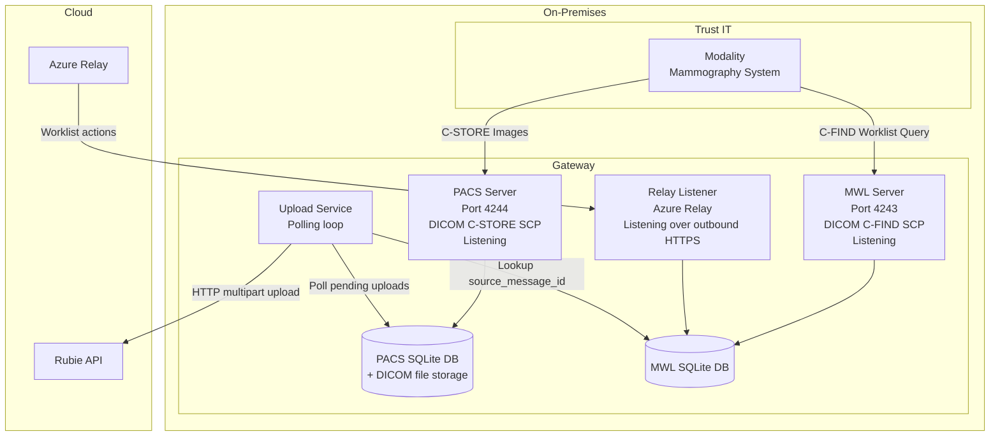
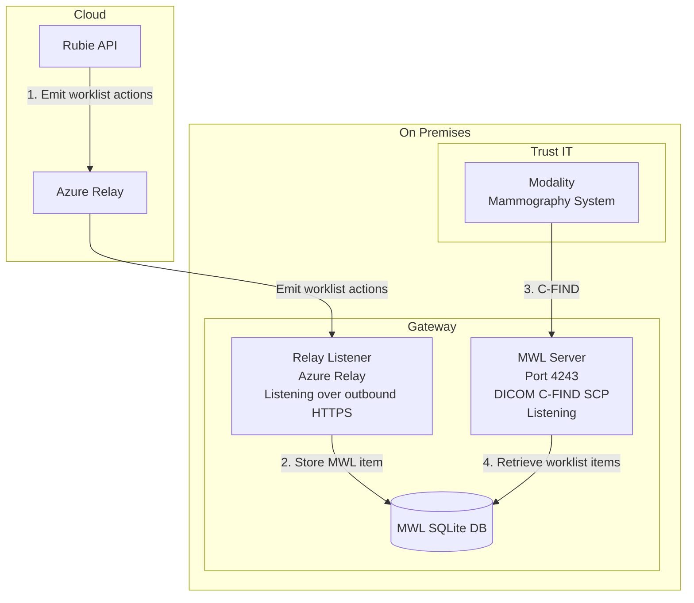
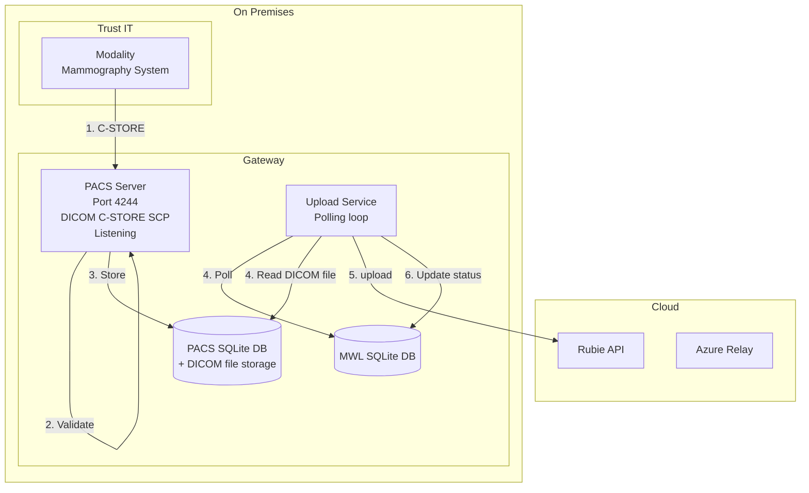

# Gateway Architecture and Data Flows

This document summarises the architecture of the Rubie Gateway, its protocols and data flows.

## Overview

This gateway implements a lightweight DICOM service architecture:

1. **DICOM Worklist Server** - Provides scheduled procedure information to modalities ([docs](mwl/README.md))
2. **DICOM PACS Server** - Receives and stores medical images ([docs](pacs/README.md))
3. **Event Processing** - Processes appointment status updates and image metadata ([docs](upload/README.md))
4. **Azure Relay Communication** - Bidirectional communication with cloud service ([docs](relay-listener/README.md))

### Modality Worklist (MWL) Server

The MWL server provides `C-FIND` functionality for modalities to query the scheduled procedure information.

See [MWL documentation](mwl/README.md) for detailed information.

### PACS Server

The PACS server provides `C-STORE` functionality for receiving medical images:

- Content-addressable storage
- SQLite metadata indexing
- Thread-safe concurrent access

See [PACS documentation](pacs/README.md) for detailed information.

### Relay Listener

The Relay Listener handles incoming messages from the cloud service via Azure Relay:

- Listens on configured Hybrid Connection
- Processes worklist actions (e.g., create worklist item)

See [Relay Listener documentation](relay-listener/README.md) for details.

The gateway bridges on-premises breast screening modalities with the cloud-based Rubie platform.

Core runtime services:

- PACS Server (`C-STORE` receiver)
- Modality Worklist (MWL) Server (`C-FIND` responder)
- Relay Listener (Azure Relay WebSocket listener over outbound HTTPS)
- Upload Service (background poller and HTTP uploader)

## Topology

## Protocols, Inputs, Outputs, and Transfer Direction

| Service | Input | Output | Protocol(s) | Listening or Initiating? |
| --- | --- | --- | --- | --- |
| PACS Server | DICOM image objects from modality | Compressed/stored DICOM + PACS metadata rows | DICOM `C-STORE` (+ `C-ECHO`) | **Listening** on default port `4244` |
| MWL Server | Worklist queries from modality | Matching worklist records | DICOM `C-FIND` (+ MPPS updates) | **Listening** on default port `4243` |
| Relay Listener | GatewayAction-style worklist messages from cloud service | Created/updated MWL worklist items | Azure Relay WebSocket over outbound HTTPS (`443`) | **Listening** via persistent outbound connection |
| Upload Service | Pending PACS rows + DICOM files + MWL linkage data | Uploaded image payloads and status updates | HTTPS `POST` multipart/form-data | **Initiating** outbound HTTP requests |

## End-to-End Data Flows

### 1. Worklist down to modality

This happens via 2 flows:

1. Rubie service emits worklist action via [Azure Relay websocket](https://learn.microsoft.com/en-us/azure/azure-relay/relay-hybrid-connections-protocol).
2. Gateway relay listener receives message and writes MWL item to MWL SQLite DB.
3. Separately, the Modality sends DICOM `C-FIND` query to MWL server.
4. MWL server responds with matching scheduled procedure items.

### 2. Images up to cloud

This also happens via 2 flows:

1. Modality sends DICOM `C-STORE` to PACS server.
2. PACS validates tags and pixel data, decompresses if required, resizes, and recompresses (JPEG 2000 lossy).
3. PACS stores file in content-addressable filesystem layout and records metadata in PACS SQLite DB.
4. In parallel, the Upload service polls for `PENDING` items, reads the DICOM file, and finds `source_message_id` via MWL data.
5. Upload service sends multipart HTTPS upload to Rubie API with `X-Source-Message-ID`.
6. Upload status is updated (`COMPLETE` or retried/fails after max retries).

### 3. Worklist status progression

- `SCHEDULED` when created from relay message.
- Moves to `IN PROGRESS` when image activity begins (`C-STORE` observed).
- Finalised by MPPS events (`COMPLETED` or `DISCONTINUED`).
- Daily backup-and-clear is run by scheduled task (`reset_main.py`), preparing next day’s workload.

## Storage and Processing Notes

- PACS file storage uses content-addressable paths derived from `SOPInstanceUID`.
- PACS metadata and MWL data are stored in separate SQLite databases.
- Compression and resizing are intentional to support thumbnail/display workflows in the cloud UI; full-resolution clinical images remain in BSU internal PACS.

## Deployment Characteristics

- PACS and MWL are designed to run as separate services/containers.
- Gateway can operate behind strict firewalls because relay communication is maintained via outbound HTTPS.
- Upload is asynchronous and retry-based (polling + exponential backoff).
