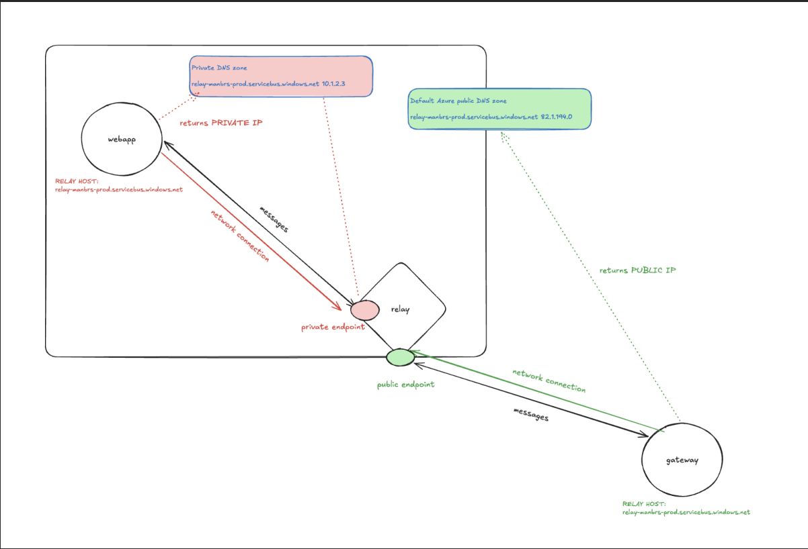

# FAQ: Private DNS / Private Endpoint Connectivity Issues

## Current Flow



## Symptoms

In some cases, a newly created Azure Private Endpoint may not function
correctly immediately after deployment, despite showing as **Approved**
and having no obvious configuration or Azure-reported errors.

One example occurred during the gateway deployment, where the
application running in Azure Container Apps could no longer establish a
connection to the Azure Relay over its Private Endpoint.

Although DNS resolution continued to work correctly, network
connectivity to the resolved private IP address failed.

## How to Verify
See [Live Clinic Debugging](../runbooks/live-clinic-debugging.md)

First, connect to the running Container App:

``` bash
az containerapp exec \
  -n manbrs-web-prod \
  -g rg-manbrs-prod-container-app-uks \
  --command sh
```

Verify that the hostname resolves to the expected private IP:

``` bash
/app/.venv/bin/python -c "import socket; print(socket.getaddrinfo('relay-manbrs-prod.servicebus.windows.net', 443)[0][4])"
```

**Expected output:**

(example address within the prod hub VNet range 10.11.0.0/16):

('10.11.4.8', 443)

This confirms that Private DNS resolution is functioning correctly.

The exact private IP may vary if the Private Endpoint is recreated, but it should remain within the 10.11.0.0/16 range for this environment.

Next, test network connectivity to the resolved private IP:
- Assuming the IP is 10.11.4.8

```bash
nc -v 10.11.4.8 443
```

### Expected Result

``` text
10.11.4.8 (10.11.4.8:443) open
```

### Failure Behaviour

If the command hangs indefinitely (or eventually times out), DNS is
resolving successfully but traffic cannot reach the Private Endpoint.

This typically presents like a firewall, routing, or networking issue,
despite no apparent configuration problems.

## Root Cause

During investigation:

-   The Private Endpoint connection was **Approved** (not Pending).
-   Private DNS resolved the correct private IP address.
-   The Private Endpoint configuration matched the equivalent working
    environment (Pre-Production).
-   No Terraform drift or configuration differences were identified.

Based on these findings, the issue appeared to be an Azure platform
issue rather than a deployment or configuration problem.

It is possible this was:

-   An intermittent Azure networking issue affecting the Private
    Endpoint; or
-   A transient issue during Private Endpoint creation, potentially
    caused by a timing/race condition within Azure.

The exact underlying cause could not be confirmed.

## Resolution

The issue was resolved by:

1.  Deleting the affected Private Endpoint.
2.  Re-running the Terraform deployment to recreate the Private Endpoint
    and its associated connection.

Once recreated, connectivity was immediately restored.

## Lessons Learned

-   Successful Private DNS resolution **does not guarantee** that the
    Private Endpoint is functioning correctly.
-   An **Approved** Private Endpoint connection can still fail to pass
    traffic.
-   Comparing against a known working environment can help rule out
    configuration drift.
-   If DNS resolves correctly but connectivity to the Private IP
    consistently hangs, recreating the Private Endpoint should be
    considered before opening a Microsoft support case, as this has
    successfully resolved the issue in practice.

> **Note:** Microsoft Support could have been engaged to investigate the
> underlying platform behaviour. However, recreating the Private
> Endpoint restored service immediately, whereas a platform
> investigation would likely have taken considerably longer. At the time
> of writing, there is no evidence that Terraform or the infrastructure
> configuration contributed to the issue.
