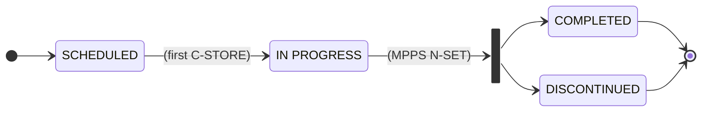

# MWL Server

DICOM [Modality Worklist (MWL)](https://dicom.nema.org/medical/dicom/current/output/html/part04.html#chapter_K) server for managing scheduled breast screening appointments and providing worklist information to imaging modalities.

## Overview

The MWL server is a lightweight, production-ready DICOM worklist solution that:

- Provides scheduled procedure information via [DICOM C-FIND](https://dicom.nema.org/medical/dicom/current/output/html/part04.html#chapter_C) protocol
- Stores worklist items in SQLite database
- Supports filtering by modality, date, and patient ID
- Resets the worklist daily via a scheduled `reset_main.py` script invoked by Windows Task Scheduler
- Runs as a Python process on a Windows VM managed by Azure Arc

## Architecture

### Components

```text
┌─────────────────────────────────────────────────────────────┐
│                    MWL Server (Port 4243)                   │
├─────────────────────────────────────────────────────────────┤
│                                                             │
│  ┌──────────────┐      ┌──────────────┐      ┌──────────┐   │
│  │   C-FIND     │─────▶│   Storage    │─────▶│ SQLite   │◀──┼──────────────────┐
│  │   Handler    │      │   Layer      │      │ Database │   │                  │
│  └──────────────┘      └──────────────┘      └──────────┘   │                  │
│         │                      ▲                            │                  │
│         │                      │                            │        backup + clear
│         └──────────────────────┘                            │      (Task Scheduler)
│         Query & Response                                    │                  │
└─────────────────────────────────────────────────────────────┘                  │
           ▲                         ▲                                   ┌───────┴────────┐
           │                         │                                   │  reset_main.py │
    ┌──────┴──────┐          ┌───────┴────────┐                          └────────────────┘
    │  Modality   │          │ Relay Listener │
    │  (SCU)      │          │ (Populates DB) │
    └─────────────┘          └────────────────┘
```

### Workflow

1. **Worklist Creation**: Relay listener receives appointments from Manage Breast Screening and creates worklist items
2. **Worklist Query**: Modality sends C-FIND request to MWL server
3. **Filtering**: MWL server filters by modality, date, patient ID, status
4. **Response**: Server returns matching worklist items to modality
5. **Status Updates**: C-STORE receipt transitions items from `SCHEDULED` to `IN PROGRESS`; [MPPS](https://dicom.nema.org/medical/dicom/current/output/html/part04.html#chapter_F) transitions items to `COMPLETED` or `DISCONTINUED`
6. **Daily Reset**: Windows Task Scheduler invokes `reset_main.py`, which backs up and clears the database

## Running the MWL Server

The gateway runs as a Python process on a Windows VM:

```bash
# Start the MWL server
uv run python -m mwl_main

# Run a one-shot backup and reset (normally invoked by Task Scheduler)
uv run python -m reset_main
```

For local development, Docker Compose is available:

```bash
docker compose up -d mwl
docker compose logs -f mwl
```

## Configuration

### MWL server

| Variable | Default | Description |
| -------- | ------- | ----------- |
| `MWL_AET` | `MWL_SCP` | Application Entity Title |
| `MWL_PORT` | `4243` | DICOM service port |
| `MWL_DB_PATH` | `/var/lib/pacs/worklist.db` | SQLite database path |
| `LOG_LEVEL` | `INFO` | Logging level |

### Reset script (`reset_main.py`)

| Variable | Default | Description |
| -------- | ------- | ----------- |
| `MWL_DB_PATH` | `/var/lib/pacs/worklist.db` | SQLite database path |
| `BACKUP_PATH` | `/var/lib/pacs/backups` | Directory for database backups |
| `LOG_LEVEL` | `INFO` | Logging level |

The reset schedule is configured in Windows Task Scheduler (registered via `scripts/bat/schtasks.bat`), not in the application.

## Scheduling the daily reset (Windows)

Register the scheduled task (run once, on the gateway VM):

```bat
scripts\bat\schtasks.bat
```

This creates a Task Scheduler task that runs `reset_main.py` daily at midnight. The schedule can be adjusted in Task Scheduler or via Azure Arc without any code change.

## Example query

```python
from pynetdicom import AE, QueryRetrievePresentationContexts
from pydicom import Dataset

ae = AE()
ae.requested_contexts = QueryRetrievePresentationContexts

# Create query dataset
ds = Dataset()
ds.PatientID = '9876543210'
ds.PatientName = ''
ds.AccessionNumber = ''

# Scheduled procedure step query
sps = Dataset()
sps.Modality = 'MG'
sps.ScheduledProcedureStepStartDate = '20260108'
ds.ScheduledProcedureStepSequence = [sps]

# Send C-FIND with Worklist Information Model ('W')
assoc = ae.associate('localhost', 4243, ae_title='MWL_SCP')
responses = assoc.send_c_find(ds, query_model='W')
for (status, identifier) in responses:
    if status.Status in (0xFF00, 0xFF01):
        print(f"Found: {identifier.PatientName}")
assoc.release()
```

## Verification

Check worklist items:

```bash
sqlite3 /var/lib/pacs/worklist.db \
  "SELECT accession_number, patient_name, scheduled_date, status FROM worklist_items;"
```

Add test worklist item:

```bash
sqlite3 /var/lib/pacs/worklist.db <<EOF
INSERT INTO worklist_items (
    accession_number, patient_id, patient_name, patient_birth_date,
    scheduled_date, scheduled_time, modality, study_description
) VALUES (
    'ACC001', '9876543210', 'TEST^PATIENT', '19800101',
    '20260108', '100000', 'MG', 'Bilateral Screening Mammogram'
);
EOF
```

## Integration testing

**Running integration tests:**

```bash
uv run pytest tests/integration/test_c_find_returns_worklist_items.py -v
uv run pytest tests/integration/test_request_cfind_on_worklist.py -v
```

## Worklist item status transitions



See [ADR-003: Separate containers for PACS and MWL](../adr/ADR-003_Separate_containers_for_PACS_and_MWL.md) and [ADR-004: Daily backup and reset of the MWL database](../adr/ADR-004_MWL_Daily_Backup_And_Reset.md) for architectural decisions.
